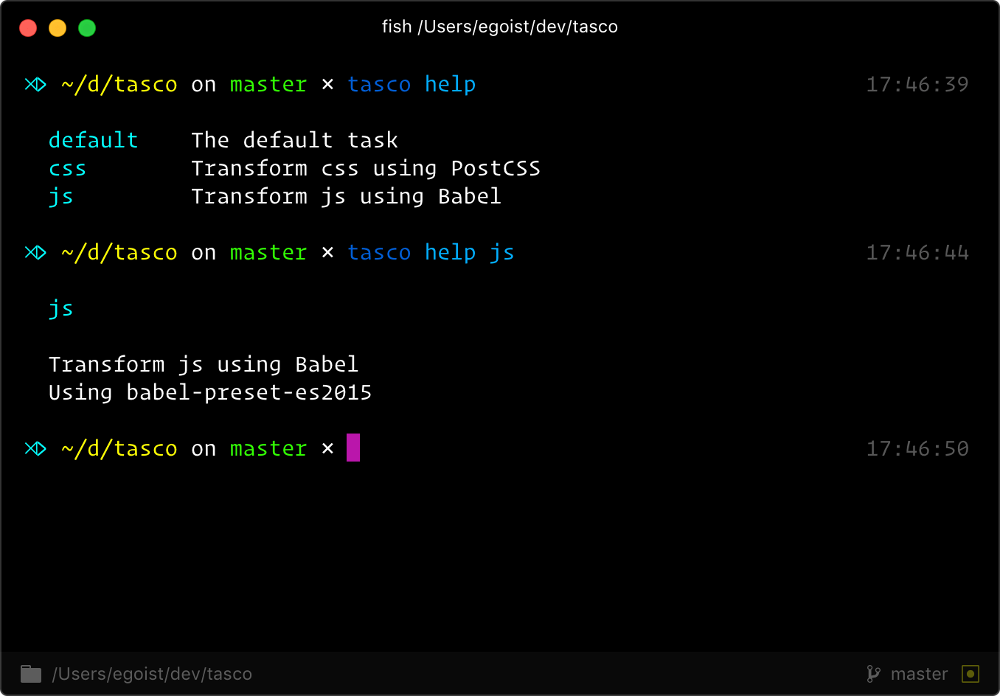

# tasco

[](https://npmjs.com/package/tasco) [](https://npmjs.com/package/tasco) [](https://circleci.com/gh/egoist/tasco) [](https://github.com/egoist/donate)

## Install

```bash
npm i -g tasco
```

## Usage

Populate a `taskfile.js` in your project:

```js
// The default task
export default async function (t) {
  await t.parallel('css', 'js')
}

// Transform css using PostCSS
// Using postcss-cssnext
export async function css(t) {
  await t
    .input('./css/*.css')
    .postcss()
    .output('./dist/css/')
}

// Transform js using Babel
// Using babel-preset-es2015
export async function js(t) {
  await t
    .input('./js/*.js')
    .babel()
    .output('./dist/js/')
}
```

Then fire the default task from command-line:

```bash
tasco
# or specific task
tasco js
```

Another neat feature, run `tasco help` to get information about all tasks.



You can using JavaScript comments to describe the tasks, it should be present right before the task. Both single-line and multi-line comments are supported. In `tasco help` only the first line of the description will be print, you can read full description for specific task via `tasco help <taskname>`

The description also supports [templating](#templating).

## Use a plugin

Just install a plugin in your project and it will be automatically loaded, plugin name follows the `tasco-[name]` convention.

Check out the [doc](#plugin) for building a plugin.

### API

#### templating

You can use `{{ expression }}` in task description, we use [vegito](https://github.com/egoist/vegito) under the hood, for example:

```js
// this task builds {{ chalk.yellow('js files') }}
export async function js(t) {
  await t.input().babel().output() //...
}
```

Available variables:

- `chalk`: The [chalk](https://github.com/chalk/chalk) module.

#### t.input(...globs)

`t.input([globs])` or `t.input(globA, globB...)`

#### t.output(destDir)

The directory to write files.

#### t.parallel(tasks)

Run multiple tasks in parallel.

#### t.sequence(tasks)

Run multiple tasks in sequence.

#### plugin

##### plugin.name

Type: `string`<br>
Requried: `true`

The property on `t` to bind plugin.

For example, if `name` is `babel` then you can use `t.babel`

##### plugin.pipe

Type: `function`<br>
Required: `true`

The `pipe` function, eg, add a piper to compile js using Babel:

```js
module.exports = {
  name: 'babel',
  pipe(options) {
    this.files.forEach((file, index) => {
      this.files[index].content = babel
        .transform(this.files[index].content, options)
        .code
    })
  }
}
```

The `pipe` function should return a Promise or perform synchronize operations.

#### Register plugin

Plugin can be installed from npm and automatically loaded. For testing plugin locally, you can use `t.use` function:

```js
const plugin = {
  name: 'doSomething', 
  pipe() {}
}

export async function build(t) {
  t.use(plugin)
  await t.input().doSomething().output()
}
```

## Contributing

1. Fork it!
2. Create your feature branch: `git checkout -b my-new-feature`
3. Commit your changes: `git commit -am 'Add some feature'`
4. Push to the branch: `git push origin my-new-feature`
5. Submit a pull request :D


## Author

**tasco** © [egoist](https://github.com/egoist), Released under the [MIT](./LICENSE) License.<br>
Authored and maintained by egoist with help from contributors ([list](https://github.com/egoist/tasco/contributors)).

> [egoistian.com](https://egoistian.com) · GitHub [@egoist](https://github.com/egoist) · Twitter [@rem_rin_rin](https://twitter.com/rem_rin_rin)
